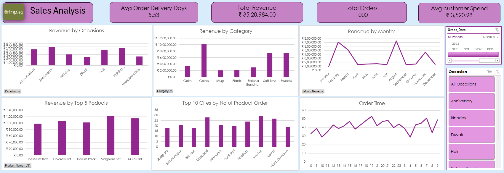

# Sales-Analysis-Dashboard-Excel 

## 📊 **Overview**  
This project delivers a comprehensive sales performance analysis using Microsoft Excel. It combines interactive charts, slicers, and advanced modeling techniques to provide actionable business insights. Key KPIs include **Total Revenue, Average Customer Spend, and Order Delivery Days**.  

## 🧠 **Insights**  
- Revenue breakdown by Occasion, Category, and Month  
- Top 5 Products and Top 10 Cities by Orders  
- Order Time Analysis to identify peak hours  
- Interactive filters for Occasion and Date  

## 🧰 **Tools & Techniques**  
- **Microsoft Excel** for visualization and reporting  
- **Power Query** for data cleaning and transformation  
- **Power Pivot** for data modeling and relationships  
- **DAX Functions** for custom KPIs and measures  
- Dashboard design and storytelling with data  

## 🚀 **How to Use**  
1. Download the files from the [Raw_Sales_Data](Raw_Sales_Data/) folder.  
2. Open [Fnp_Data_and_Dashboard.xlsx](Fnp_Data_and_Dashboard.xlsx) in Microsoft Excel.  
3. Explore slicers, charts, and measures to interact with the dashboard.  

## 📸 **Dashboard Preview**  
  
Or click to view: [Dashboard_Preview.png](Dashboard_Preview.png)

## 🧑‍💻 **Author**  
**Subhendu Chowdhury**  
Aspiring Data Analyst | Skilled in Power BI & Excel | Exploring SQL, DAX & Python  
Languages: English, German, Bangla  

